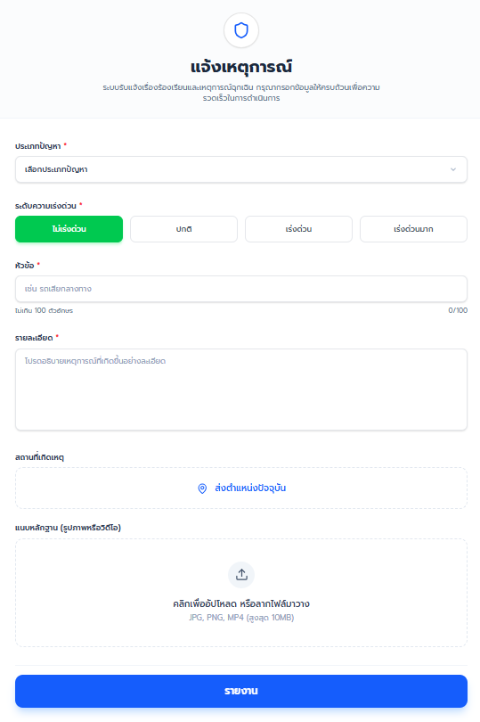
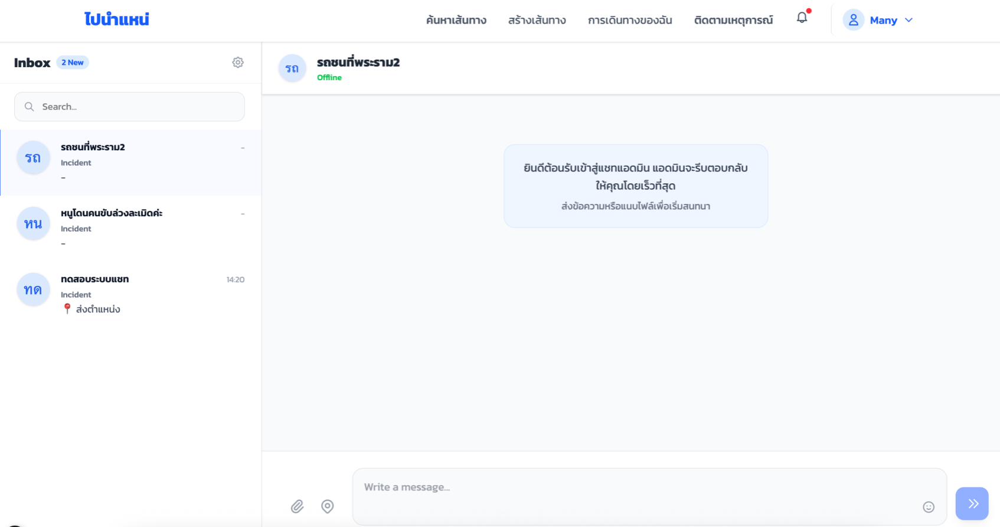

# User Manual  
## Product Backlog Item No.6  
### User Chat & Incident Reporting System (Passenger / Driver)

**User Story:**  
As a Passenger or Driver, I want to communicate with the admin and report incidents so that I can track issues and receive updates efficiently.

---

## การใช้งานสำหรับผู้ใช้งาน (Passenger / Driver)

เอกสารฉบับนี้อธิบายขั้นตอนการใช้งานระบบสำหรับผู้ใช้งาน โดยแบ่งเป็นการใช้งาน **Chat** และ **Form Incident** เพื่อให้ผู้ใช้งาน (User) สามารถติดต่อผู้ดูแลระบบ (Admin) และติดตามสถานะเคสได้อย่างเป็นระบบ

---

### 1. การเข้าสู่ระบบ (Login)

1. ไปที่หน้า **Login**  
2. กรอกข้อมูล **User/Email** และ **Password**  
3. กดปุ่ม **เข้าสู่ระบบ (Login)**  

---

### 2. ระบบแจ้งเตือน (Notification)

1. ไปที่หน้า Dashboard User
2. กดปุ่ม แจ้งเตือน Notification ด้านขวาบน เพื่อดูข้อมูลและการแจ้งเตือนจาก Admin

--

### 3. Form Incidents

#### 3.1 สำหรับผู้โดยสาร (Passenger)
1. เข้าสู่เมนู: เข้าสู่ระบบและเลือกเมนู "Form Incident"
2. ระบุรายละเอียดเหตุการณ์: กรอกข้อมูลในแบบฟอร์มให้ครบถ้วน
3. ประเภทปัญหา: เลือกหมวดหมู่ของปัญหาจากรายการ
4. ระดับความเร่งด่วน: เลือกความสำคัญ (ไม่เร่งด่วน, ปกติ, เร่งด่วน หรือ เร่งด่วนมาก)
5. หัวข้อ: ระบุชื่อเรื่องสั้นๆ (เช่น รถเสียระหว่างทาง) ไม่เกิน 100 ตัวอักษร
6. รายละเอียด: อธิบายเหตุการณ์ที่เกิดขึ้นอย่างละเอียดในช่องข้อความ
7. สถานที่เกิดเหตุ: กดปุ่ม "ส่งตำแหน่งปัจจุบัน" เพื่อปักหมุดพิกัด
8. แนบหลักฐาน: อัปโหลดรูปภาพหรือวิดีโอ (JPG, PNG, MP4) ขนาดไม่เกิน 10MB
9. ส่งข้อมูล: ตรวจสอบความถูกต้องแล้วกดปุ่ม "รายงาน" (ปุ่มสีน้ำเงินด้านล่าง)
10. ยืนยันผล: ระบบจะแสดงข้อความยืนยันเมื่อส่งข้อมูลสำเร็จ

#### 3.2 สำหรับคนขับ (Driver)
1. เข้าสู่เมนู: เข้าสู่ระบบและไปที่หน้า "Form Incident"
2. ระบุรายละเอียดเหตุการณ์: กรอกข้อมูลในแบบฟอร์มให้ครบถ้วน
3. ประเภทปัญหา: เลือกหมวดหมู่ของปัญหาจากรายการ
4. ระดับความเร่งด่วน: เลือกความสำคัญ (ไม่เร่งด่วน, ปกติ, เร่งด่วน หรือ เร่งด่วนมาก)
5. หัวข้อ: ระบุชื่อเรื่องสั้นๆ (เช่น รถเสียระหว่างทาง) ไม่เกิน 100 ตัวอักษร
6. รายละเอียด: อธิบายเหตุการณ์ที่เกิดขึ้นอย่างละเอียดในช่องข้อความ
7. สถานที่เกิดเหตุ: กดปุ่ม "ส่งตำแหน่งปัจจุบัน" เพื่อปักหมุดพิกัด
8. แนบหลักฐาน: อัปโหลดรูปภาพหรือวิดีโอ (JPG, PNG, MP4) ขนาดไม่เกิน 10MB
9. ส่งข้อมูล: ตรวจสอบความถูกต้องแล้วกดปุ่ม "รายงาน" (ปุ่มสีน้ำเงินด้านล่าง)
10. ยืนยันผล: ระบบจะแสดงข้อความยืนยันเมื่อส่งข้อมูลสำเร็จ

--

### 4. Chat กับ Admin

1. เมื่อผู้ใช้งานส่ง Incident หรือมี Notification จาก Admin ให้กดเข้า **Mini-Chat**  
2. ระบบจะแสดงหน้าต่าง Chat กับ Admin
3. ผู้ใช้งานสามารถพิมพ์ข้อความและกด **Send** เพื่อสื่อสารกับ Admin  
4. ข้อความตอบกลับจาก Admin จะแสดงทันทีแบบ Real-time  
5. สามารถเลื่อนดูประวัติข้อความย้อนหลังได้
6. สามารถแนบรูปภาพเพิ่มเติมในแชท ได้ไม่เกิน 50MB ต่อ 1 รูป
7. สามารถแนบ GPS เพิ่มเติมในแชทได้

---

## สรุปการทำงานของระบบ

ระบบสำหรับ Passenger และ Driver ถูกออกแบบมาเพื่อให้การแจ้งเหตุและการสื่อสารกับผู้ดูแลระบบเป็นไปอย่างมีประสิทธิภาพ โดยผู้ใช้งานสามารถ:

- แจ้งเหตุการณ์หรือปัญหาผ่าน Form Incident ได้อย่างเป็นระบบ พร้อมแนบหลักฐานและตำแหน่งที่เกิดเหตุ
- สื่อสารกับผู้ดูแลระบบแบบ Real-time ผ่านระบบ Chat
- ตรวจสอบสถานะของ Incident และรับการแจ้งเตือน (Notification) เมื่อมีการอัปเดต
- รับข้อมูลการแก้ไขปัญหา (Resolution Note) จากผู้ดูแลระบบโดยตรง
- ติดตามประวัติการรายงานและการสนทนาได้อย่างต่อเนื่องในระบบ

ระบบนี้ช่วยเพิ่มความสะดวก รวดเร็ว และโปร่งใสในการจัดการปัญหา ทำให้ผู้ใช้งานสามารถติดตามความคืบหน้าและมั่นใจได้ว่าทุกเหตุการณ์ได้รับการดูแลอย่างเหมาะสม