# User Manual 

## การใช้งานสำหรับผู้โดยสาร

### 1. การเข้าสู่ระบบ
1.1ไปที่หน้า Login 
1.2กรอก Email และ Password
1.3กดปุ่มเข้าสู่ระบบ
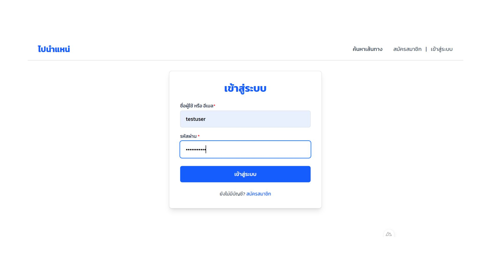  

### 2. การใช้งานหน้า My Trip 
2.1ดูรายการการเดินทาง
-เลือกเมนู การเดินทางของฉัน
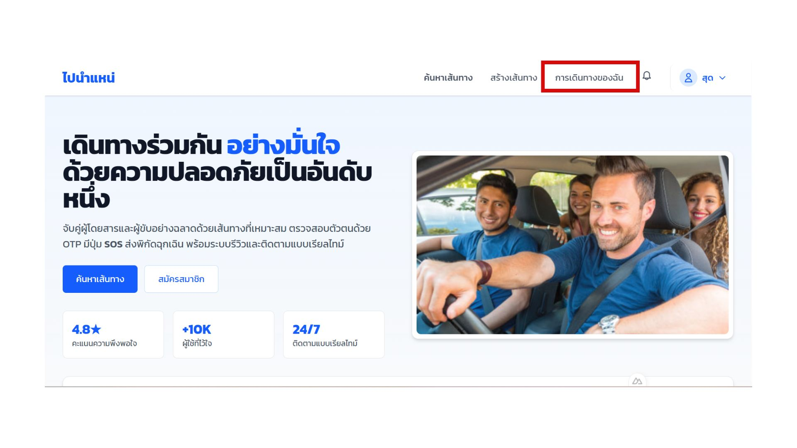  
-เลือกรายการที่ ยืนยันแล้ว
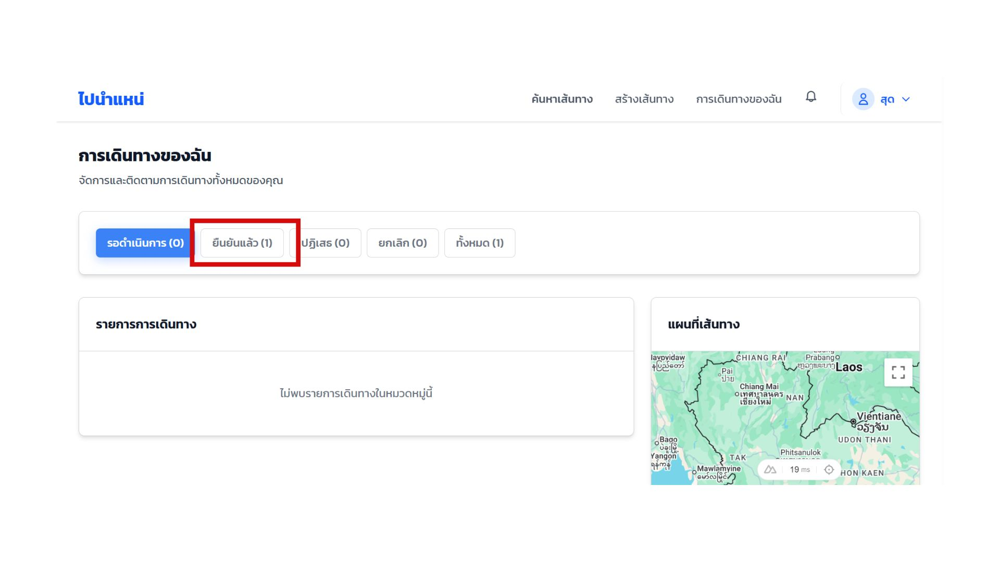  
-ระบบจะแสดงรายระเอียดการเดินทาง
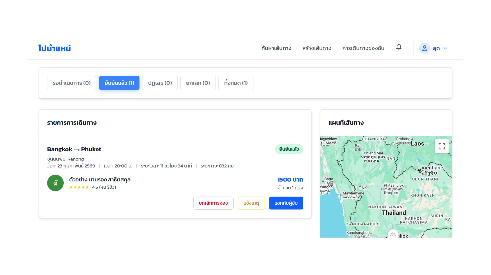  

2.2การแจ้งเหตุ
-เลือกการเดินทางที่ต้องการ
-กดปุ่ม แจ้งเหตุ
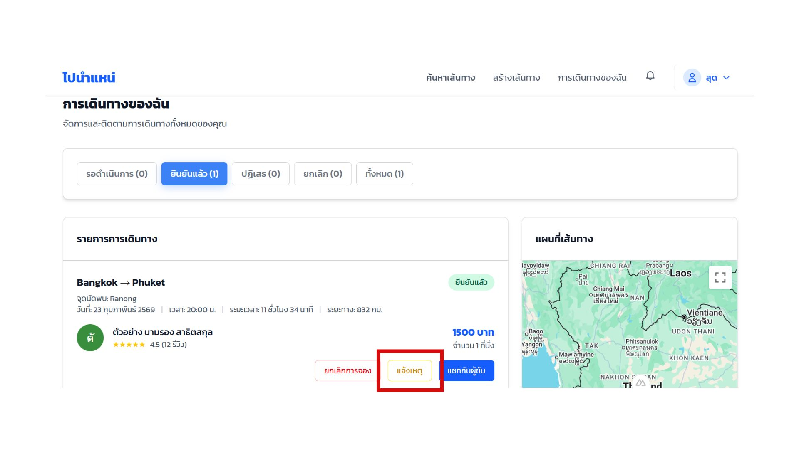  
-ระบบจะนำไปที่หน้า Form Incident
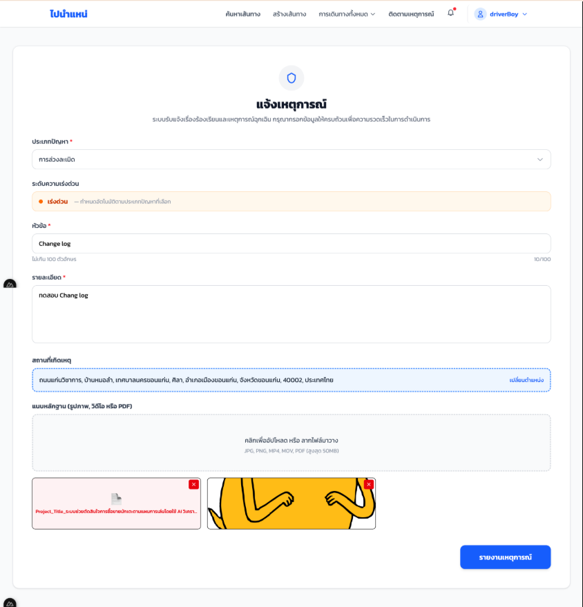  

### 3. การกรอกฟอร์มแจ้งเหตุ
3.1เลือกประเภทปัญหา
-มี dropdown สำหรับเลือกประเภทปัญหา
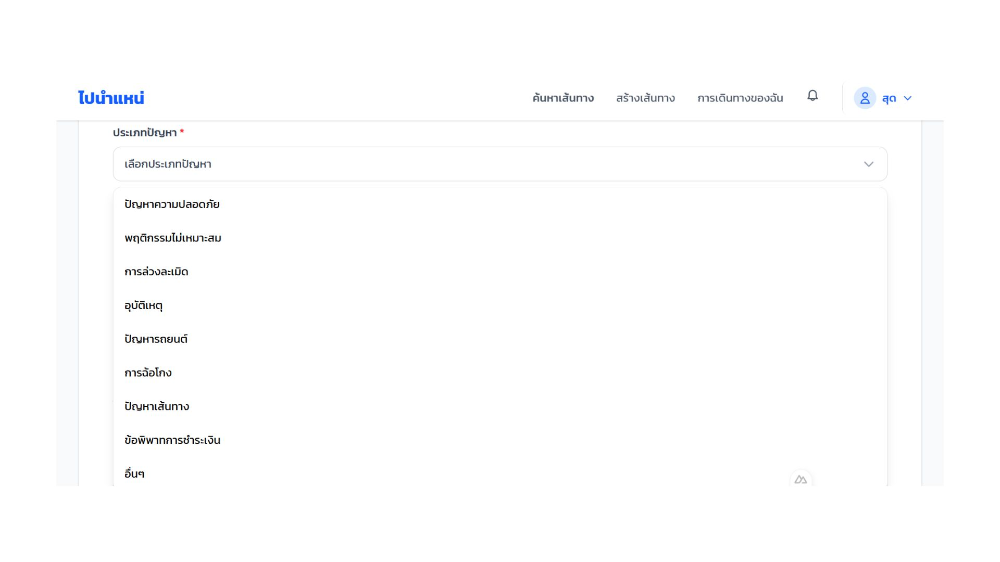  
3.2กรอกหัวข้อ
3.3กรอกรายละเอียด
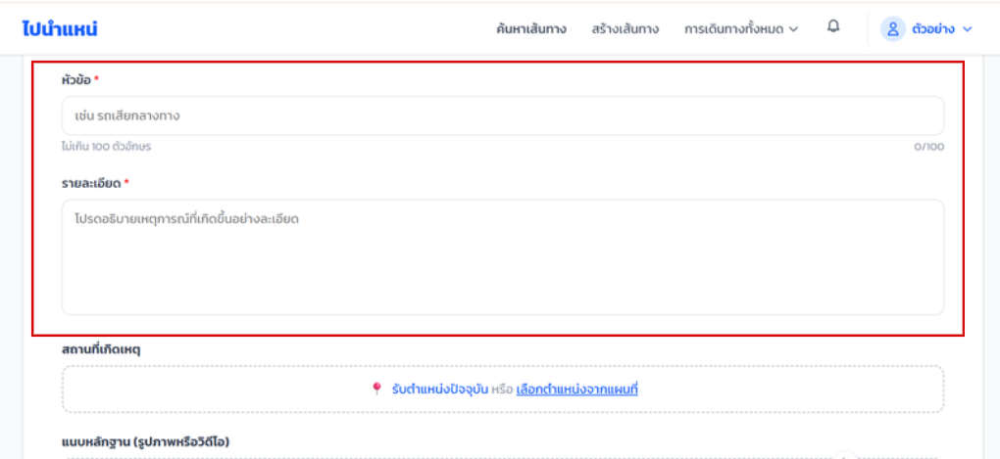  
3.4เลือกสถานที่เกิดเหตุ
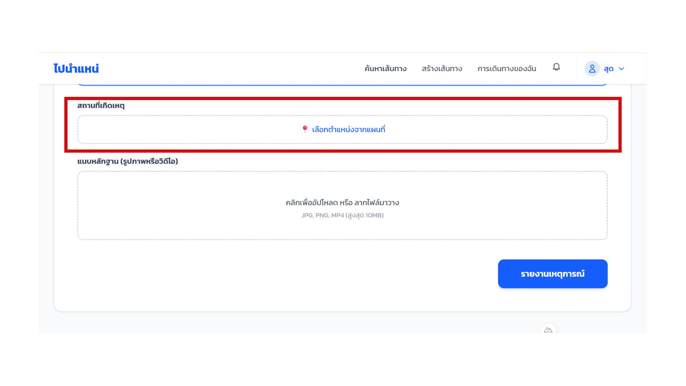  
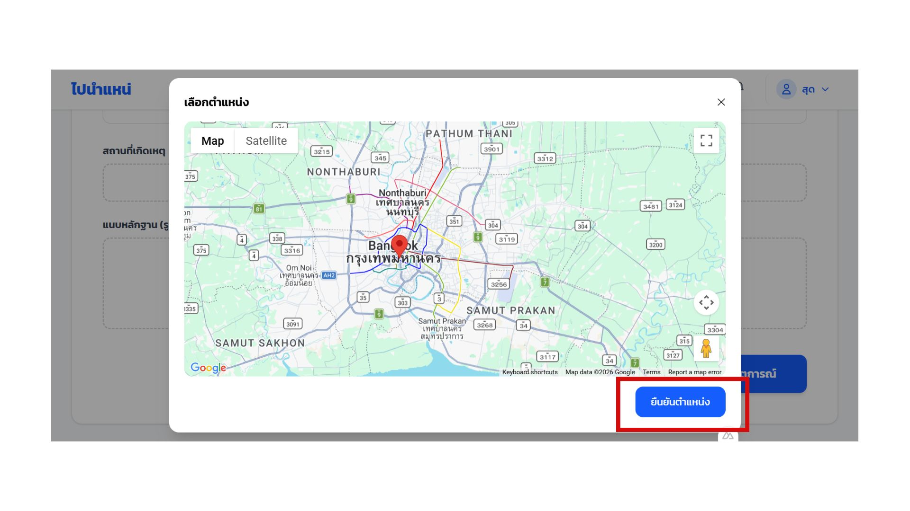  
3.5แนบหลักฐาน (รูปภาพหรือวิดิโอ)
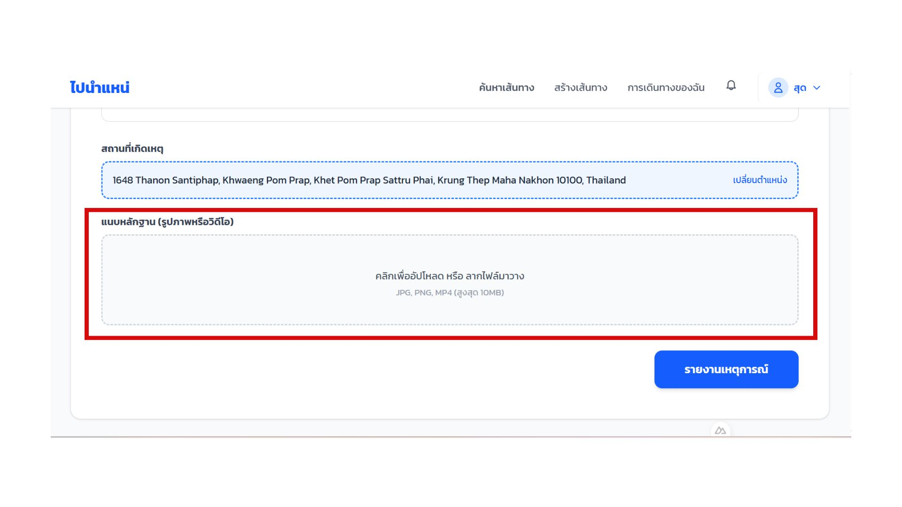  
3.6กด รายงานเหตุการณ์
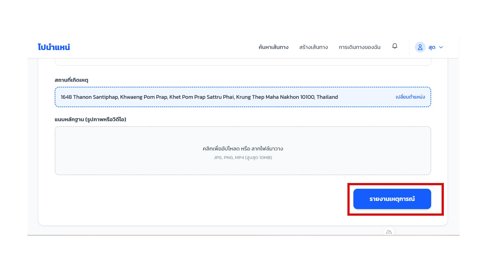  

### 4. หน้าต่างยืนยันการส่งรายงานเหตุการณ์
เมื่อส่งข้อมูลสำเร็จ จะปรากฏหน้าต่างแจ้งว่า ส่งข้อมูลเรียบร้อยแล้ว
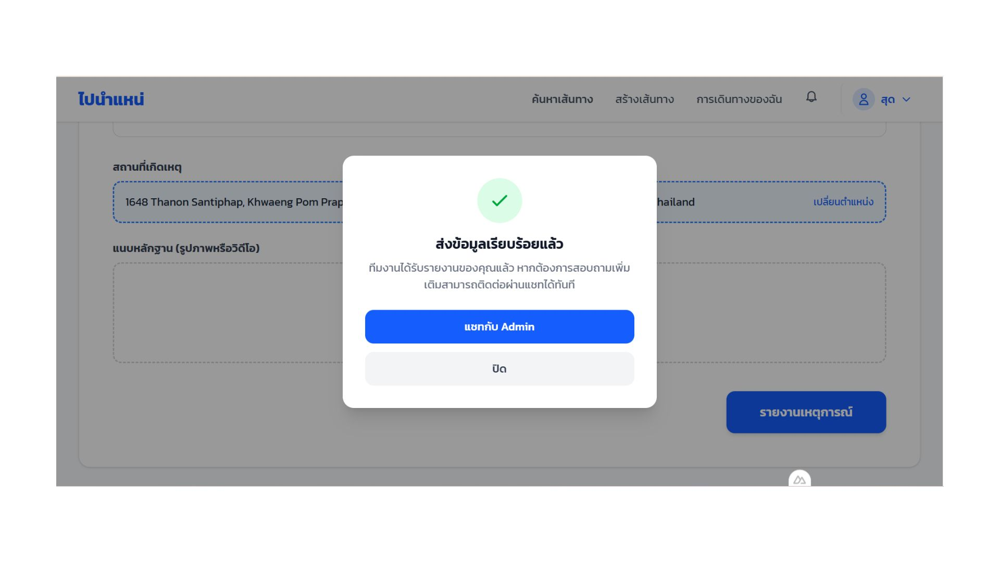  

