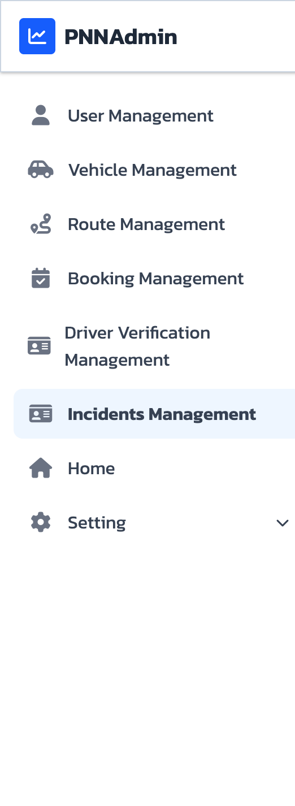

# User Manual  
## Product Backlog Item No.6  
As an admin, I want to keep the users updated on their reported incidents

---

## การใช้งานสำหรับผู้ดูแลระบบ (Admin)

---

### 1. การเข้าสู่ระบบ

1.1 ไปที่หน้า Login  
1.2 กรอก Email และ Password ของผู้ดูแลระบบ  
1.3 กดปุ่ม เข้าสู่ระบบ  

---

### 2. การเข้าสู่หน้า Incident Management

2.1 หลังจากเข้าสู่ระบบสำเร็จ ระบบจะแสดงหน้า Admin Dashboard  
2.2 เลือกเมนู Incident Management  

---

### 3. ภาพรวมหน้า Incident Management

หน้า Incident Management ประกอบด้วย

- กล่องสรุปจำนวนเคสทั้งหมด (Total Incidents)  
- จำนวนเคสที่รอดำเนินการ (Pending)  
- จำนวนเคสเร่งด่วน (Urgent)  
- ตารางแสดงรายการ Incident ทั้งหมด  

---

### 4. การกรองข้อมูลเคส (Filter)

4.1 กรองตามสถานะ (Status)  
- เลือกสถานะที่ต้องการ เช่น  
  - PENDING  
  - INVESTIGATING  
  - RESOLVED  

4.2 กรองตามระดับความสำคัญ (Priority)  
- LOW  
- NORMAL  
- HIGH  
- URGENT  

### 5. การตรวจสอบรายละเอียด Incident

5.1 ในตาราง Incident ให้กดปุ่ม View Detail ของเคสที่ต้องการ  

ระบบจะแสดงหน้าต่างรายละเอียด (Incident Detail Modal) ซึ่งประกอบด้วย

- Reporter Role (Driver  Passenger)  
- Title  
- Description  
- ไฟล์แนบ (รูปภาพ  วิดีโอ)  
- ตำแหน่ง Location ผ่าน Google Maps  
- ช่องกรอก Resolution Note  

---

### 6. การอัปเดตสถานะเคส

6.1 ในตารางหลัก สามารถเปลี่ยนสถานะผ่าน Dropdown Status ได้ทันที  

- ระบบจะอัปเดตสถานะเป็น RESOLVED  
- บันทึก Resolution Note  
- ปิดหน้าต่างรายละเอียด  

---

### 7. การสื่อสารกับผู้ใช้งาน

7.1 ในหน้า Incident Detail มีปุ่ม Start Chat  
7.2 เมื่อกดปุ่ม ระบบจะเชื่อมต่อไปยังหน้า Chat 

---

### 8. การส่งข้อความ

8.1 ในหน้าChat จะมีlist ของuserที่ติดต่อเข้ามา 
8.2 ในแต่ละChat room แอดมินจะสามารถส่ง ข้อวาม ไฟล์ โลเคชั่น แก่userได้
8.3 Admin สามารถ End conversation เมื่อต้องการ

---

## สรุปการทำงานของระบบ

ระบบ Incident Management สำหรับผู้ดูแลระบบ ช่วยให้สามารถ

- ตรวจสอบเคสที่ผู้ใช้รายงานเข้ามา  
- กรองและจัดลำดับความสำคัญของเคส  
- ตรวจสอบหลักฐานและตำแหน่งที่เกิดเหตุ  
- อัปเดตสถานะการดำเนินงาน  
- แจ้งผลการจัดการกลับไปยังผู้ใช้  

