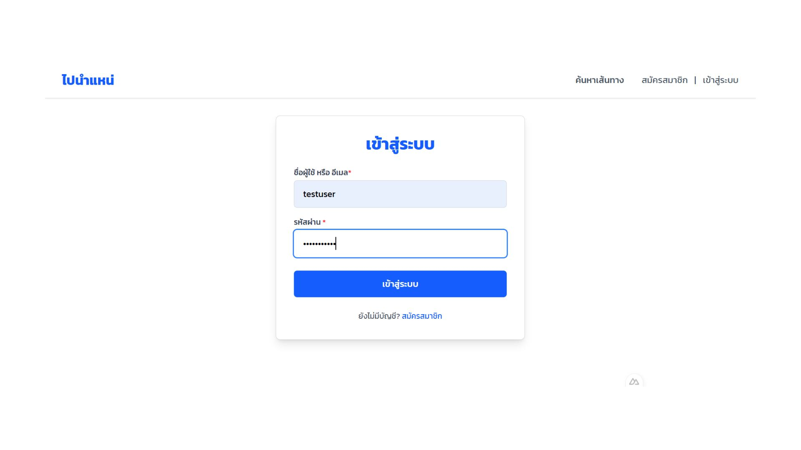
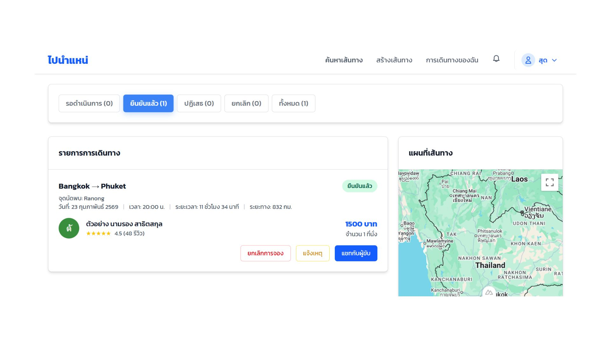
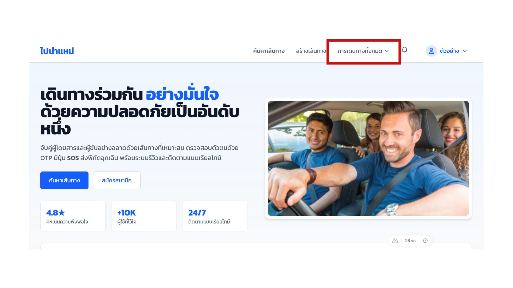
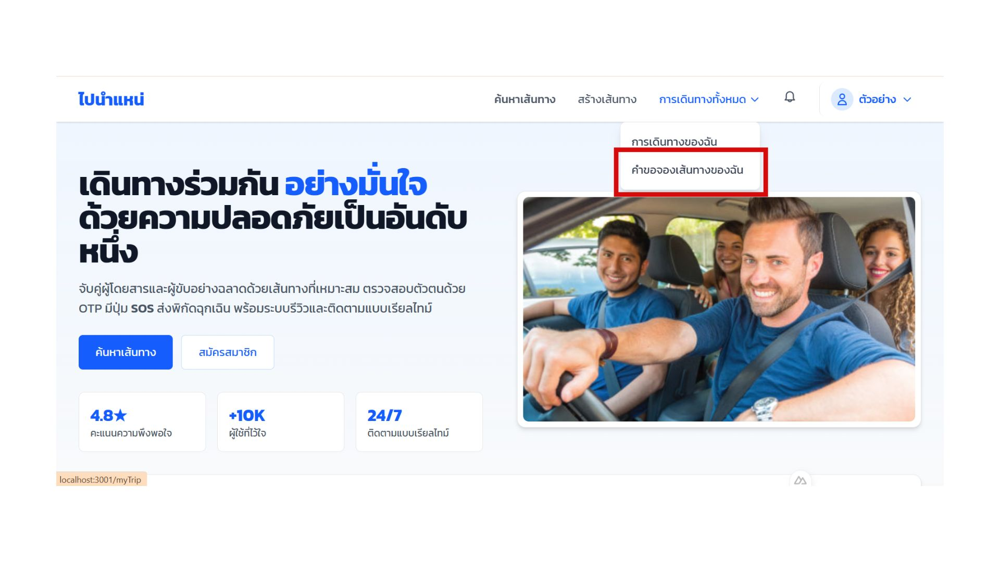
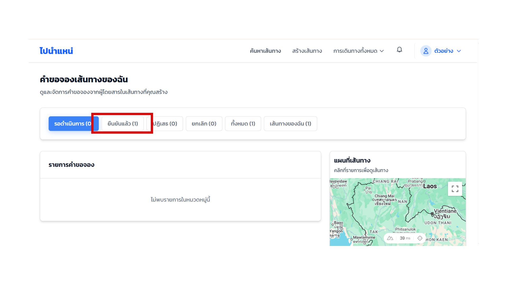
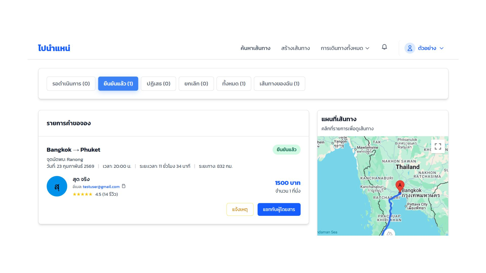
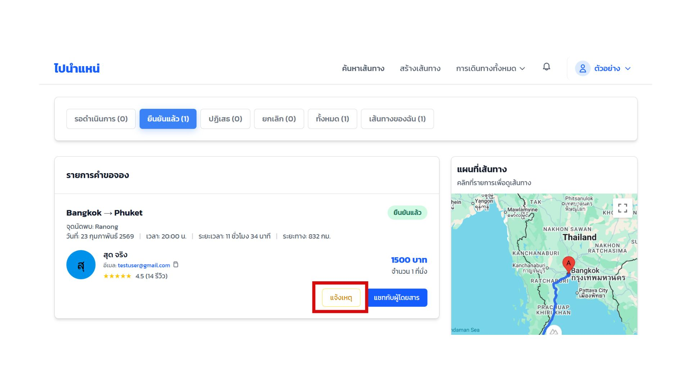
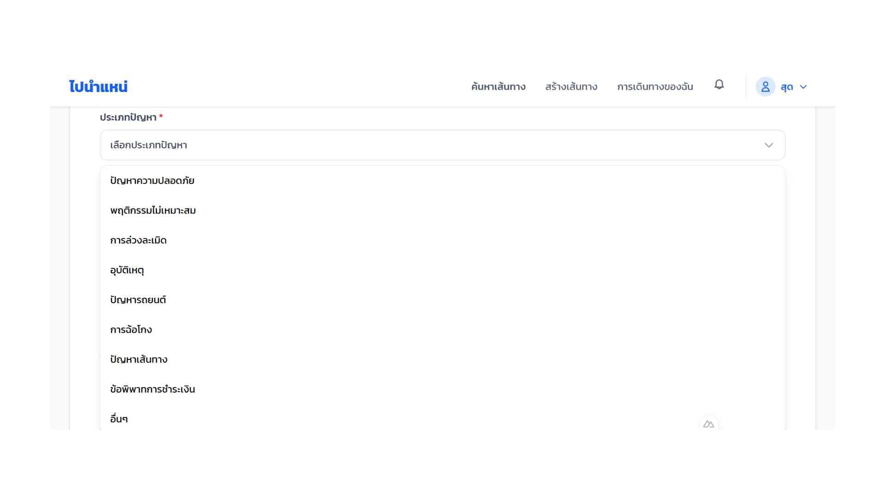
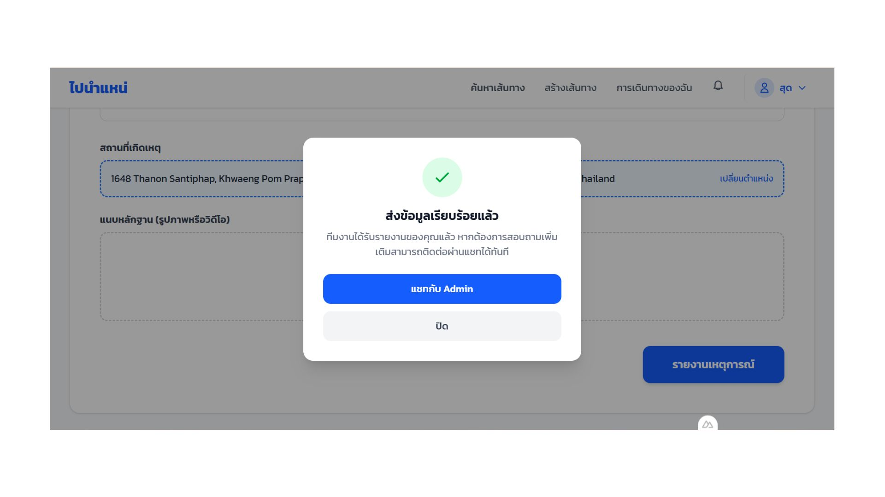

# User Manual 

## การใช้งานสำหรับผู้โดยสาร

### 1. การเข้าสู่ระบบ
1.1ไปที่หน้า Login 
1.2กรอก Email และ Password
1.3กดปุ่มเข้าสู่ระบบ
  

### 2. การใช้งานหน้า My Trip (สำหรับผู้โดยสาร)
2.1ดูรายการการเดินทาง
-เลือกเมนู การเดินทางของฉัน
  
-เลือกรายการที่ ยืนยันแล้ว
  
-ระบบจะแสดงรายระเอียดการเดินทาง
  

2.2การแจ้งเหตุ
-เลือกการเดินทางที่ต้องการ
-กดปุ่ม แจ้งเหตุ
  
-ระบบจะนำไปที่หน้า Form Incident
  

### 3. การใช้งานหน้า My Route (สำหรับผู้ขับ)
2.1ดูรายการการเดินทาง
-เลือกเมนู การเดินทางทั้งหมด
   
-เลือก คำขอจองเส้นทางของฉัน
   
-เลือกรายการที่ ยืนยันแล้ว
   
-ระบบจะแสดงรายระเอียดการเดินทาง
   

2.2การแจ้งเหตุ
-เลือกการเดินทางที่ต้องการ
-กดปุ่ม แจ้งเหตุ
   
-ระบบจะนำไปที่หน้า Form Incident
  

### 4. การกรอกฟอร์มแจ้งเหตุ
4.1เลือกประเภทปัญหา
-มี dropdown สำหรับเลือกประเภทปัญหา
  
  
4.2เลือกประเภทความเร่งด่วน
-มีระดับความเร่งด่วน 4 ระดับ คือ ไม่เร่งด่วน ปกติ เร่งด่วน เร่งด่วนมาก
4.3กรอกหัวข้อ
4.4กรอกรายละเอียด
  
4.5เลือกสถานที่เกิดเหตุ
  
  
4.6แนบหลักฐาน (รูปภาพหรือวิดิโอ)
  
4.7กด รายงานเหตุการณ์
  

### 5. หน้าต่างยืนยันการส่งรายงานเหตุการณ์
เมื่อส่งข้อมูลสำเร็จ จะปรากฏหน้าต่างแจ้งว่า ส่งข้อมูลเรียบร้อยแล้ว
ผู้ใช้สามารถกดปุ่มแชทกับ Admin หรือปิดหน้าต่าง
  

### 6. การใช้งานระบบแชท
6.1เมื่อกดปุ่ม แชทกับ Admin
  
6.2ระบบจะนำไปยังหน้า Chat

